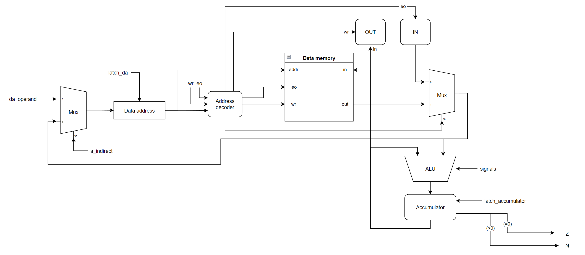

Транслятор и модель

- Григорьев Андрей P33111.
- `lisp -> asm | acc | harv | hw | tick -> instr | struct | stream | mem | pstr | prob5 | [4]char`
- Упрощенный вариант

## Язык программирования
Синтаксис предполагается похожим на NASM
``` ebnf
program ::= {instruction}
instruction ::= opcode [operand] | label ":" | label ":" db value [dup]
opcode ::= "LD" | "ST" | "SUB" | "ADD" | "DIVR" | "INC" | "DEC" | "JMP" | "JNZ" | "JZ" | "JN" | "HLT" | "CLR"
operand ::= number | label
indirect_operand ::= "[" operand "]"
value ::= number | string
number ::= {digit} | "0x" {hex_digit}
string ::= '"' {text, except '"'} '"'
label ::= {alpha, except '['} {alpha | digit}
dup ::= "dup" 
<!-- if dup - value = length of buffer-->
comment ::= ";" {text}
code_section ::= "SECTION .text"
data_section ::= "SECTION .data"
```
По умолчанию адресация прямая, при заключени операнда в квадратные скобки, адресация косвенная.

Повторное объявлени метки запрещено.

## Организация памяти

- Program memory: машинное слово -- не определено. Реализуется списком словарей.
- Data memory: машинное слово -- 32 бита, знаковое. Реализуется именованным массивом.

```text
Program memory
+-----------------------------+
| 0:  LD  4343                |
| 1:  INC                     |
| 2:  ST  4242                |
|                             |
| n:  JMP 0                   |
+-----------------------------+

Data memory
+-----------------------------+
| 0: var                      |
|    ...                      |
| 1023: var                   |
| 4242: out port              |
| 4343: in port               |
+-----------------------------+
```
## Система команд


Особенности процессора:
- Машинное слово -- 32 бит, знаковое.
- `Память`:
    - адресуется через регистр `data_address`;
    - запись из аккумулятора
    - может быть прочитана:
        - в acc;
        - в data_address;
- Ввод-вывод -- MMIO.
- `program_counter` -- счётчик команд:
    - инкрементируется после каждой инструкции или перезаписывается инструкцией перехода (MUX is_jmp).
- Поддерживается прямая и косвенная адресация


### Набор инструкций

| Opcode | Такты | Описание |
|--------|-------|----------|
|LD`<addr>`|2-3| загрузка из памяти данных в аккумуляторб поддерживает косвенную адресацию
|ST`<addr>`|2-3| сохранение из аккумулятора в память данных, поддерживает косвенную адресацию
|SUB`<addr>`|1| вычитание из аккумулятора
|ADD`<addr>`|1| сложение с аккумулятором
|CLR|1| обнуление аккумулятора
|DIVR`<addr>`|1| остаток от деления аккумулятора на значение
|INC|2| инкремент аккумулятора
|DEC|2| декремент аккумулятора
|JMP`<addr>`|1| безусловный переход
|JNZ`<addr>`|2| переход, если аккумулятор не равен нулю
|JZ`<addr>`|2| переход, если аккумулятор равен нулю
|JN`<addr>`|2| переход, если аккумулятор отрицателен
|HLT|0| остановка

Левый вход ALU -- аккумулятор, правый -- значение из памяти данных/устройства ввода.


### Кодирование инструкций

- Машинный код сериализуется в массив JSON.
- Один элемент списка, одна инструкция.


Пример:

```json
[
   {
        "position": 0, 
        "opcode": "LD", 
        "operand": 19, 
        "op_type": "INDIRECT", 
        "src_line": 17
    }
]
```

где:
- `position` -- позиция в памяти программы;
- `opcode` -- строка с кодом операции;
- `operand` -- аргумент (может отсутствовать);
- `op_type` -- тип адресации;
- `src_line` -- номер строки исходного кода.


## Транслятор

Интерфейс командной строки: `translator.py <input_file> <target_code_file> <target_data_file>"`

Реализовано в модуле: [translator](./translator.py)

Этапы трансляции (функция `translate`):
1. Трансформирование текста в последовательность значимых термов.
2. Указание типа операнда
3. Подстановка лейблов


## Модель процессора

Интерфейс командной строки: `model.py <code_file> <data_file> <input_file>`


- `latch_data_address` -- защёлкнуть значение в `data_address`

### DataPath

Реализован в классе `DataPath`.



- `da_operand` -- адрес, полученный из операнда инструкции.
- `is_indirect` -- флаг косвенной адресации.
- `latch_da` -- защёлкнуть значение в `data_address`.
- `wr` -- флаг записи в память.
- `eo` -- флаг чтения.
- `signals` -- команды для ALU
- `latch_accumulator` -- защёлкнуть значение в аккумуляторе.

- `Z` -- флаг нуля в аккумуляторе
- `N` -- флаг отрицательности аккумулятора

### ControlUnit
Реализован в классе `ControlUnit`.


- Hardwired.
- Моделирование на уровне инструкций.

`latch_pc` -- защёлкнуть значение в `program_counter`.
`is_jmp` -- флаг перехода.

## Тестирование

Golden тесты: [golden](./golden_test.py)
- hello: [hello.asm](./asm_src/hello.asm) [hello.yml](./golden/hello.yml)
- cat: [cat.asm](./asm_src/cat.asm) [cat.yml](./golden/cat.yml)
- hello_user_name: [hello_user_name.asm](./asm_src/hello_user_name.asm) [hello_user_name.yml](./golden/hello_user_name.yml)
- prob5: [prob5.asm](./asm_src/prob5.asm) [prob5.yml](./golden/prob5.yml)

Запуск:
```bash
poetry run coverage run -m pytest .
```

Рассмотрим программу `hello_user_name.asm`:

```asm
            SECTION .data
prompt:     db "What is your name?"
prompt_ptr: db prompt               ; prompt_ptr = &prompt
greet:      db "Hello, "    
greet_ptr:  db greet                ; greet_ptr = &greet
n_char:     db 10                   ; \n
after:      db 33                   ; "!"
ptr:        db 0    
len:        db 0    
buf:        db 0                    ; input buffer
name:       db 20       dup         ; name
name_ptr:   db name                 ; name_ptr = &name


            SECTION .text
_start:
            LD  [prompt_ptr]        ; *prompt_ptr = prompt[0]
            ST  len
            LD  prompt_ptr          ; ptr = prompt_ptr
            ST  ptr                 ; ptr = prompt_ptr
_loop_prompt:
            LD  ptr
            INC
            ST  ptr                 ; ptr++
            LD  [ptr]               ; buf = *ptr
            ST  4242                ; output buffer
            LD  len
            DEC
            ST  len                 ; len--
            JNZ _loop_prompt        ; if len != 0, goto _loop_prompt

            LD  n_char              ; \n
            ST  4242                ; output buffer

            CLR
            ST len                  ; len = 0
            LD name_ptr
            INC
            ST ptr                  ; ptr = &name[1]

_loop_name_in:
            LD  4343                ; input
            ST  buf                 ; buf = input
            SUB n_char              ; buf -= '\n'
            JZ  _store_name_len     ; if buf == '\n', goto _store_name_len
            LD  buf
            ST  [ptr]               ; *ptr = buf
            LD  ptr
            INC
            ST  ptr                 ; ptr++
            LD  len
            INC
            ST  len                 ; len++
            JMP _loop_name_in


_store_name_len:
            LD len
            ST name                 ; name[0] = len


            LD [greet_ptr]          ; *greet_ptr = greet[0]
            ST len 
            LD greet_ptr
            ST ptr                  ; ptr = &greet[0]
_loop_greet:
            LD  ptr
            INC
            ST  ptr                 ; ptr++
            LD  [ptr]               ; buf = *ptr
            ST  4242                ; output
            LD  len
            DEC
            ST  len                 ; len--
            JNZ _loop_greet         ; if len != 0, goto _loop_greet


            LD [name_ptr]           ; *name_ptr = name[0]
            ST len 
            LD name_ptr
            ST ptr                  ; ptr = &name[0]
_loop_name_out:
            LD  ptr
            INC
            ST  ptr                 ; ptr++
            LD  [ptr]               ; buf = *ptr
            ST  4242                ; output
            LD  len
            DEC
            ST  len                 ; len--
            JNZ _loop_name_out      ; if len != 0, goto _loop_greet


_print_after:
            LD after
            ST 4242                 ; output buffer
```

Вывод программы:
```
> What is your name?
<Andrey
>Hello, Andrey!
```

Машинный код:

```json
 [{"position": 0, "opcode": "LD", "operand": 19, "op_type": "INDIRECT", "src_line": 15},
  {"position": 1, "opcode": "ST", "operand": 32, "op_type": "DIRECT", "src_line": 16},
  {"position": 2, "opcode": "LD", "operand": 19, "op_type": "DIRECT", "src_line": 17},
  {"position": 3, "opcode": "ST", "operand": 31, "op_type": "DIRECT", "src_line": 18},
  {"position": 4, "opcode": "LD", "operand": 31, "op_type": "DIRECT", "src_line": 20},
  {"position": 5, "opcode": "INC", "operand": null, "op_type": "NONE", "src_line": 21},
  {"position": 6, "opcode": "ST", "operand": 31, "op_type": "DIRECT", "src_line": 22},
  {"position": 7, "opcode": "LD", "operand": 31, "op_type": "INDIRECT", "src_line": 23},
  {"position": 8, "opcode": "ST", "operand": 4242, "op_type": "DIRECT", "src_line": 24},
  {"position": 9, "opcode": "LD", "operand": 32, "op_type": "DIRECT", "src_line": 25},
  {"position": 10, "opcode": "DEC", "operand": null, "op_type": "NONE", "src_line": 26},
  {"position": 11, "opcode": "ST", "operand": 32, "op_type": "DIRECT", "src_line": 27},
  {"position": 12, "opcode": "JNZ", "operand": 4, "op_type": "DIRECT", "src_line": 28},
  {"position": 13, "opcode": "LD", "operand": 29, "op_type": "DIRECT", "src_line": 29},
  {"position": 14, "opcode": "ST", "operand": 4242, "op_type": "DIRECT", "src_line": 30},
  {"position": 15, "opcode": "CLR", "operand": null, "op_type": "NONE", "src_line": 31},
  {"position": 16, "opcode": "ST", "operand": 32, "op_type": "DIRECT", "src_line": 32},
  {"position": 17, "opcode": "LD", "operand": 54, "op_type": "DIRECT", "src_line": 33},
  {"position": 18, "opcode": "INC", "operand": null, "op_type": "NONE", "src_line": 34},
  {"position": 19, "opcode": "ST", "operand": 31, "op_type": "DIRECT", "src_line": 35},
  {"position": 20, "opcode": "LD", "operand": 4343, "op_type": "DIRECT", "src_line": 37},
  {"position": 21, "opcode": "ST", "operand": 33, "op_type": "DIRECT", "src_line": 38},
  {"position": 22, "opcode": "SUB", "operand": 29, "op_type": "DIRECT", "src_line": 39},
  {"position": 23, "opcode": "JZ", "operand": 33, "op_type": "DIRECT", "src_line": 40},
  {"position": 24, "opcode": "LD", "operand": 33, "op_type": "DIRECT", "src_line": 41},
  {"position": 25, "opcode": "ST", "operand": 31, "op_type": "INDIRECT", "src_line": 42},
  {"position": 26, "opcode": "LD", "operand": 31, "op_type": "DIRECT", "src_line": 43},
  {"position": 27, "opcode": "INC", "operand": null, "op_type": "NONE", "src_line": 44},
  {"position": 28, "opcode": "ST", "operand": 31, "op_type": "DIRECT", "src_line": 45},
  {"position": 29, "opcode": "LD", "operand": 32, "op_type": "DIRECT", "src_line": 46},
  {"position": 30, "opcode": "INC", "operand": null, "op_type": "NONE", "src_line": 47},
  {"position": 31, "opcode": "ST", "operand": 32, "op_type": "DIRECT", "src_line": 48},
  {"position": 32, "opcode": "JMP", "operand": 20, "op_type": "DIRECT", "src_line": 49},
  {"position": 33, "opcode": "LD", "operand": 32, "op_type": "DIRECT", "src_line": 51},
  {"position": 34, "opcode": "ST", "operand": 34, "op_type": "DIRECT", "src_line": 52},
  {"position": 35, "opcode": "LD", "operand": 28, "op_type": "INDIRECT", "src_line": 53},
  {"position": 36, "opcode": "ST", "operand": 32, "op_type": "DIRECT", "src_line": 54},
  {"position": 37, "opcode": "LD", "operand": 28, "op_type": "DIRECT", "src_line": 55},
  {"position": 38, "opcode": "ST", "operand": 31, "op_type": "DIRECT", "src_line": 56},
  {"position": 39, "opcode": "LD", "operand": 31, "op_type": "DIRECT", "src_line": 58},
  {"position": 40, "opcode": "INC", "operand": null, "op_type": "NONE", "src_line": 59},
  {"position": 41, "opcode": "ST", "operand": 31, "op_type": "DIRECT", "src_line": 60},
  {"position": 42, "opcode": "LD", "operand": 31, "op_type": "INDIRECT", "src_line": 61},
  {"position": 43, "opcode": "ST", "operand": 4242, "op_type": "DIRECT", "src_line": 62},
  {"position": 44, "opcode": "LD", "operand": 32, "op_type": "DIRECT", "src_line": 63},
  {"position": 45, "opcode": "DEC", "operand": null, "op_type": "NONE", "src_line": 64},
  {"position": 46, "opcode": "ST", "operand": 32, "op_type": "DIRECT", "src_line": 65},
  {"position": 47, "opcode": "JNZ", "operand": 39, "op_type": "DIRECT", "src_line": 66},
  {"position": 48, "opcode": "LD", "operand": 54, "op_type": "INDIRECT", "src_line": 67},
  {"position": 49, "opcode": "ST", "operand": 32, "op_type": "DIRECT", "src_line": 68},
  {"position": 50, "opcode": "LD", "operand": 54, "op_type": "DIRECT", "src_line": 69},
  {"position": 51, "opcode": "ST", "operand": 31, "op_type": "DIRECT", "src_line": 70},
  {"position": 52, "opcode": "LD", "operand": 31, "op_type": "DIRECT", "src_line": 72},
  {"position": 53, "opcode": "INC", "operand": null, "op_type": "NONE", "src_line": 73},
  {"position": 54, "opcode": "ST", "operand": 31, "op_type": "DIRECT", "src_line": 74},
  {"position": 55, "opcode": "LD", "operand": 31, "op_type": "INDIRECT", "src_line": 75},
  {"position": 56, "opcode": "ST", "operand": 4242, "op_type": "DIRECT", "src_line": 76},
  {"position": 57, "opcode": "LD", "operand": 32, "op_type": "DIRECT", "src_line": 77},
  {"position": 58, "opcode": "DEC", "operand": null, "op_type": "NONE", "src_line": 78},
  {"position": 59, "opcode": "ST", "operand": 32, "op_type": "DIRECT", "src_line": 79},
  {"position": 60, "opcode": "JNZ", "operand": 52, "op_type": "DIRECT", "src_line": 80},
  {"position": 61, "opcode": "LD", "operand": 30, "op_type": "DIRECT", "src_line": 82},
  {"position": 62, "opcode": "ST", "operand": 4242, "op_type": "DIRECT", "src_line": 83}]
```

```
| ФИО                      | алг             | LoC | code байт | code инстр. | инстр. | такт. | вариант |
|Григорьев Андрей Сергеевич| hello           | 22  |           | 13          | 103    |       | asm | acc | harv | hw | instr | struct | stream | mem | pstr | prob5 | [4]char|
|Григорьев Андрей Сергеевич| cat             | 4   |           | 3           | 33     |       | asm | acc | harv | hw | instr | struct | stream | mem | pstr | prob5 | [4]char|
|Григорьев Андрей Сергеевич| hello_user_name | 96  |           | 63          | 384    |       | asm | acc | harv | hw | instr | struct | stream | mem | pstr | prob5 | [4]char|
|Григорьев Андрей Сергеевич| prob5           | 30  |           | 17          | 1000   |       | asm | acc | harv | hw | instr | struct | stream | mem | pstr | prob5 | [4]char|
```